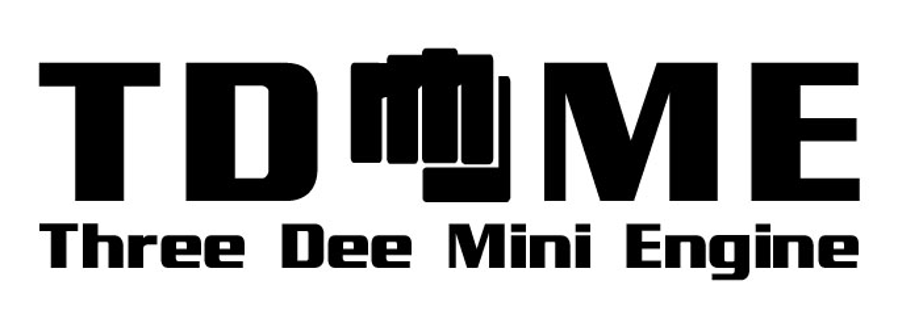

- What is TDME2?
    - ThreeDeeMiniEngine2 is a lightweight C++11 based 3D engine including tools
    - TDME2 is open source
      - please check the [license](./LICENSE) and the [licenses of used 3rd party libraries](./ext)
      - you find the source code at [https://github.com/andreasdr/tdme2](https://github.com/andreasdr/tdme2) 
      - you find binary alpha builds at [http://drewke.net/tdme2](http://drewke.net/tdme2)
      - you find developer documentation for current alpha build at [http://drewke.net/tdme2-documentation/alpha](http://drewke.net/tdme2-documentation/alpha) including collaboration graphs and private API

- What is already working
    - 3d engine
        - model parsing
            - WaveFront OBJ
            - DAE parsing with skinned meshes and animations
                - group names/ids must not have whitespace characters
                - requires baked matrices
            - FBX via FBX SDK
            - TDME Model file format
                - this is a much more efficient model file format for TDME
                - can be read and written
            - DAE and WaveFront OBJ files require triangulated meshes for now
        - animations
            - supports model object base animation and animation overlays
            - supports foliage animation for feasible models via geometry shader on GL3+/CORE using custom shaders
        - skinning via
            - CPU on GL2, GLES2
            - GPU via compute shaders with GL4.3+/CORE
        - object transformations
            - scaling
            - rotations
            - translation
        - color effects on objects, particles, ...
            - color addition
            - color multiplication
        - texture transformations/animations
            - via texture matrices
        - lighting
            - supports phong lighting
            - supports phong shading on GL3+/CORE, GL2
            - supports gouraud shading on GLES2
            - supports diffuse mapping on GL3+/CORE, GL2, GLES2
            - supports specular shininess mapping on GL3+/CORE
            - supports normal mapping on GL3+/CORE
        - shadow mapping
        - particle system which
          - is object based
          - or point based
          - and supports
            - basic/point emitter
            - sphere emitter
            - bounding box emitter
            - circle on plane emitter
            - ...
        - objects with support for LOD
        - objects with support for render groups for foliage and such
        - object picking
        - camera control
          - set up look from, look at, up vector can be computed
          - frustum culling
            - oct tree like partitioning from 64mx64mx64m up to 16mx16mx16m
        - supports offscreen instances
            - rendering can be captured as screenshot
            - rendering can be used (in other engine instances) as diffuse texture
        - screenshot ability
        - multiple renderer
          - GL2, GL3+/CORE and GLES2
    - physics via ReactPhysics3D 0.7.0
        - have sphere, capsule, obb, convex mesh, concave terrain mesh bounding volumes
        - have multiple bounding volumes per body
        - have static, dynamic rigid bodies and collision bodies
        - uses discrete collision detection
        - rigid body simulator
        - for RP3D internals and additional features see ReactPhysics3D website
    - path finding
        - uses A*
        - is paired with physics world to determine if a "cell" is walkable
        - optional custom walkable test
    - 3d audio
        - decoder
          - ogg vorbis decoder
        - audio entities
          - streams
          - sounds
    - GUI system
        - borrows some ideas from Nifty-GUI regarding XML and layouting
        - borrows some ideas from AngularJS like
            - all nodes are in the GUI node tree and can be made visible or unvisible depending on conditions
        - adds some improvements like
            - support auto keyword with nodes width and height attributes
        - supported primitive nodes from which compounds are built of
            - element
            - image
            - input
            - layout
            - panel
            - scrollbars
            - space
            - text
        - supported compound elements
            - button
            - checkbox
            - dropdown
            - image button
            - input
            - knob
            - progress bar
            - radio button
            - scrollarea both
            - scrollarea horizontal
            - scrollarea vertical
            - selectbox
            - selectbox multiple
            - slider horizontal
            - slider vertical
            - tabs
        - supports position and color based effects
    - Networking module, which consists of
        - UDP server
            - n:m threading model with non blocked IO via kernel event mechanismns(epoll, kqueue or select)
            - supports safe messages with acknowledgment and automatic resending
            - support fast messages
            - can be used in a heavy multithreaded environment (the networking module is thread safe)
            - IPV6 ready
        - UDP client
            - has single thread with a simple threadsafe API
            - supports all features required by UDP server
            - IPV6 ready

- What does it (maybe still) lack
    - animation blending
    - physics
      - some more RP3D integration
    - example games
    - documentation

- What is WIP or planned
    - LOD
    - GUI system port needs to be finished(memory management and other minor things)
    - Some UI elements need some default skinning fixes
    - WaveFront OBJ model file reader is broken currently
    - Integrate LUA to be able to write TDME2 applications completely via LUA or game logics
    - Build documentation
    - Public API documentation
    - A release plan
    - A demonstration video

- Technology
    - designed for simple multi threading
        - 3d engine uses one thread for now
        - physics or game mechanics can run in a separate thread(s)
    - uses 3rd party libraries
    	- need to be installed 
            - GLUT
            - OpenGL
            - OpenAL
            - glew
            - pthreads
        - included in TDME2 repository
            - Vorbis/OGG,
            - JsonBox
            - zlib
            - libpng
            - tinyxml
            - ReactPhysics3D
            - FBXSDK
            - V-HACD
    - targeted platforms and its current state
        - Windows/MINGW(port completed)
        - Windows/MSC(port is WIP)
        - Linux(port completed)
        - Mac Os X(port completed)
        - FreeBSD(port completed)
        - NetBSD(port completed)
        - Haiku(port completed)
        - Android(port pending)
        - iOS(port pending)

- Links
	- TDME2 Engine, see [README.md](./README.md)
    - TDME2 Model Editor, see [README-ModelEditor.md](./README-ModelEditor.md)
    - TDME2 Particle System Editor, see [README-ParticleSystemEditor.md](./README-ParticleSystemEditor.md)
    - TDME2 Level Editor, see [README-LevelEditor.md](./README-LevelEditor.md)

- External references
    - "ReactPhysics3D" physics library, [http://www.reactphysics3d.com](http://www.reactphysics3d.com) 
    - the world wide web! thank you for sharing

- Other credits
    - Mathias Lenz
    - Dominik Hepp
    - Mathias Wenzel
    - Sergiu Crăiţoiu
    - Kolja Gumpert
    - Chantal Zabel
    - others

- Interested in collaboration? Then drop me a line via mail or use the [issues section on tdme2@github](https://github.com/andreasdr/tdme2/issues)
    - You can help with testing and reporting bugs 
    - I have easy to hard task regarding engine/tools development
    - I have tasks regarding documentation
    - I even might have system administrator tasks
